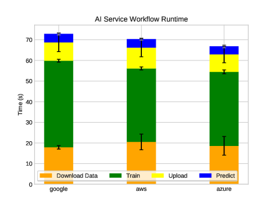

# Towards Automatically Generated Hybrid Multi-Cloud AI Services

Gregor von Laszewski, Anthony Orlowski, Richard Otten, Adam Chai*,
Reilly Markowitz*, Sunny Gandhi*,and Caleb Wilson, Indiana University

*UROC Students

## Introduction

Data scientists need to develop reusable AI services that can be
shared with their colleagues. Typically they lack the expertise to
provide such services due to the steep learning curve.  We developed a
sophisticated but easy to use framework that takes a regular Python
function (which data scientists know how to do) and converts it
automatically into a secure REST service which adheres to OpenAPI
specifications that can be reused in the ecosystem of cloud
services. We used this framework to create several AI-based REST
services to showcase the approach's validity.

## Architecture

We based our architecture on cloudmesh, an open-source hybrid
multicloud toolkit. We integrated a new component that provides data
scientists with the ability to automatically generate these services
(see Fig. 1). One of the most important aspects of generating REST
services is language independence. For this reason, we use the OpenAPI
Specification. This specification defines a standard, and
language-agnostic interface to REST APIs. Although the concept of REST
is easy to understand, a significant amount of expertise is needed to
apply it, which domain scientists may not be interested in but would
be keen on reusing without needing to know the details.

*Fig 1. Layered architecture of the cloudmesh Open\-API framework.*

Hence, our framework allows scientists to focus on their scientific
tasks exposed to well-known programming using functions and classes as
input to the generator. These functions can have AI services embedded
in them. Fig. 3 showcases our automated AI service workflow.

*Fig 2. High-level overview of the benchmark test sequence.*

*Fig 3. Comparison of the performance of Eigenface SVM algorithm on various clouds auto-generated from cloudmesh-openapi.*

## Benchmark

We developed examples based on the reuse of Scikit-learn artificial
intelligent algorithms demonstrations. These examples are then run on
different cloud services to create comparative performance
benchmarks. We conducted the benchmarks on AWS, Azure, and
Google. Additional examples conducted on IoT devices and personal
computers are discussed in [1]. We also compared the overhead of using
the REST services [1].

## Conclusion

In our benchmarks, we see that the cloud providers, when using similar
resources and images, perform similarly (see Fig. 3). For small enough
examples we find that IoT devices (such as Raspberry PI's) perform
very well [1]. Due to this good performance, the PI's are very
cost-effective for the examples we chose.  Future, work will include
more compute-intensive tasks and additional benchmarks.

However, our most significant gain from this project is the reduction
in manpower and entry barrier it takes to create and deploy our AI
services. Due to the generalized approach when using python functions
developers and data scientists can naturally integrate more complex
tasks as well as tasks that leverage cloud-specific AI services that
are uniquely offered by particular providers. GAS Generator is an
open-source project, and we appreciate contributions to the project.

## Acknowledgment

We would like to thank Lamara DeChelle Warren for initiating the
contact of the UROC students so they can be part of this effort.  We
would also like to thank B. Kegerreis, J. Beckford, J. Kandimalla,
P. Shaw, I. Mishra, F. Wang, and A. Goldfarb for developing the
service generator this work is leveraging. Finally, we would like to
thank the NIST NBDIF working group for their input.

## References

1. Using GAS for Speedy Generation of Hybrid Multi-Cloud AutoGenerated
   AI Services G. von Laszewski, A. Orlowski, R. H. Otten,
   R. Markowitz, S. Gandhi, A. Chai, C. Wilson, and G. C. Fox,
   W. L. Chang
   <https://github.com/laszewski/laszewski.github.io/raw/master/papers/vonLaszewski-openapi.pdf>

## Contact

* URL: <https://laszewski.github.io>
* Email: `laszewski@gmail.com`
